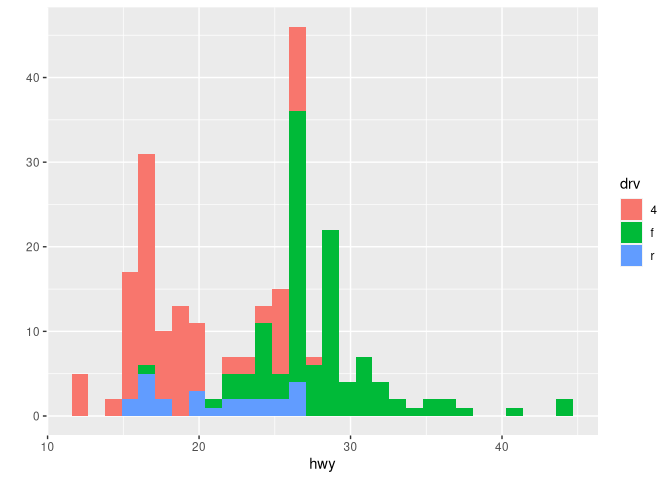
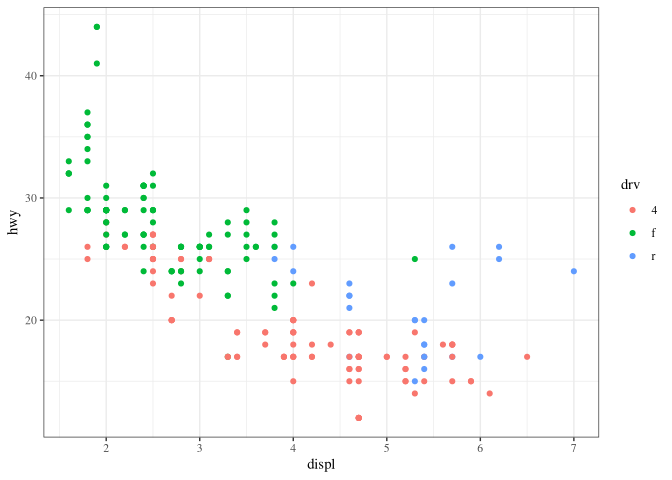
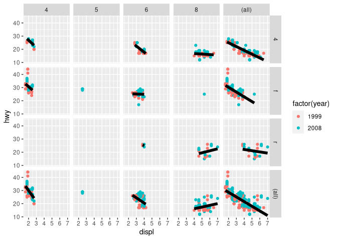
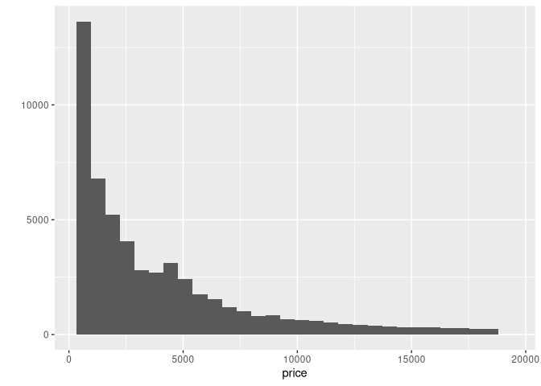

Plot Advanced
================

### Lattices Examples

Simple Example

``` r
xyplot(Ozone ~ Wind,data = airquality)
```

<!-- -->

Separate by month

``` r
xyplot(Ozone ~ Wind |as.factor(Month),data = airquality,layout=c(5,1))
```

<!-- -->

Using Function and median

``` r
# p <- xyplot(y ~ x | f, panel = function(x, y, ...) {
#   panel.xyplot(x, y, ...)  ## First call the default panel function for 'xyplot'
#   panel.abline(h = median(y), lty = 2)  ## Add a horizontal line at the median
# })
# print(p)
```

Using linear model

``` r
# p2 <- xyplot(y ~ x | f, panel = function(x, y, ...) {
#   panel.xyplot(x, y, ...)  ## First call default panel function
#   panel.lmline(x, y, col = 2)  ## Overlay a simple linear regression line
# })
# print(p2)
```

### Collors Examples

So you’re free to use any of these 600+ colors listed by the colors
function. However, two additional functions from grDevices, colorRamp
and colorRampPalette, give you more options. Both of these take color
names as arguments and use them as “palettes”, that is, these argument
colors are blended in different proportions to form new colors.

``` r
showMe<-function(cv){
  myarg <- deparse(substitute(cv))
  z<- outer( 1:20,1:20, "+")
  obj<- list( x=1:20,y=1:20,z=z )
  image(obj, col=cv, main=myarg  )
}
pal<-colorRamp(c("red","blue"))
pal(1)
```

    ##      [,1] [,2] [,3]
    ## [1,]    0    0  255

``` r
p1<-colorRampPalette(c("red","blue"))
p1(2)
```

    ## [1] "#FF0000" "#0000FF"

``` r
p2<-colorRampPalette(c("red","yellow"))
p2(2)
```

    ## [1] "#FF0000" "#FFFF00"

``` r
showMe(p2(20))
```

<!-- -->

Our last topic for this lesson is the RColorBrewer Package, available on
CRAN, that contains interesting and useful color palettes, of which
there are 3 types, sequential, divergent, and qualitative. Which one you
would choose to use depends on your data.

``` r
library(RColorBrewer)
brewer.pal(3,"BuGn")
```

    ## [1] "#E5F5F9" "#99D8C9" "#2CA25F"

``` r
cols <- brewer.pal(3, "BuGn")
showMe(cols)
```

<!-- -->

``` r
pal<-colorRampPalette(cols)
showMe(pal(20))
```

<!-- -->

``` r
image(volcano, col = pal(20))
```

<!-- -->

### GGPLOT part 1

``` r
library(ggplot2)
str(mpg)
```

    ## tibble [234 × 11] (S3: tbl_df/tbl/data.frame)
    ##  $ manufacturer: chr [1:234] "audi" "audi" "audi" "audi" ...
    ##  $ model       : chr [1:234] "a4" "a4" "a4" "a4" ...
    ##  $ displ       : num [1:234] 1.8 1.8 2 2 2.8 2.8 3.1 1.8 1.8 2 ...
    ##  $ year        : int [1:234] 1999 1999 2008 2008 1999 1999 2008 1999 1999 2008 ...
    ##  $ cyl         : int [1:234] 4 4 4 4 6 6 6 4 4 4 ...
    ##  $ trans       : chr [1:234] "auto(l5)" "manual(m5)" "manual(m6)" "auto(av)" ...
    ##  $ drv         : chr [1:234] "f" "f" "f" "f" ...
    ##  $ cty         : int [1:234] 18 21 20 21 16 18 18 18 16 20 ...
    ##  $ hwy         : int [1:234] 29 29 31 30 26 26 27 26 25 28 ...
    ##  $ fl          : chr [1:234] "p" "p" "p" "p" ...
    ##  $ class       : chr [1:234] "compact" "compact" "compact" "compact" ...

``` r
qplot(displ,hwy,data = mpg)
```

<!-- -->

``` r
qplot(displ,hwy,data = mpg,color= drv,geom = c("point","smooth"))
```

    ## `geom_smooth()` using method = 'loess' and formula 'y ~ x'

<!-- -->

``` r
qplot(drv,hwy,data = mpg,geom="boxplot")
```

<!-- -->

``` r
qplot(drv,hwy,data = mpg,geom="boxplot",color = manufacturer)
```

<!-- -->

``` r
qplot(hwy, data = mpg, fill = drv)
```

    ## `stat_bin()` using `bins = 30`. Pick better value with `binwidth`.

<!-- -->

``` r
qplot(displ, hwy, data = mpg, facets = . ~ drv)
```

<!-- -->

``` r
qplot(hwy, data = mpg, facets = drv ~ ., binwidth = 2)
```

<!-- -->

### GGPLOT part 2

``` r
qplot(displ,hwy,data = mpg,geom=c("point","smooth"),facets = .~drv)
```

    ## `geom_smooth()` using method = 'loess' and formula 'y ~ x'

<!-- -->

``` r
g<-ggplot(data = mpg,aes(displ,hwy))
g+geom_point() 
```

<!-- -->

``` r
g+geom_point()+geom_smooth()
```

    ## `geom_smooth()` using method = 'loess' and formula 'y ~ x'

<!-- -->

``` r
g+geom_point()+geom_smooth(method = "lm")
```

    ## `geom_smooth()` using formula 'y ~ x'

<!-- -->

``` r
g+geom_point()+geom_smooth(method = "lm")+facet_grid(.~drv)
```

    ## `geom_smooth()` using formula 'y ~ x'

<!-- -->

``` r
g+geom_point()+geom_smooth(method = "lm")+facet_grid(.~drv)+ggtitle("Swirl Rules!") 
```

    ## `geom_smooth()` using formula 'y ~ x'

<!-- -->

``` r
g+geom_point(color="pink",size=4,alpha=1/2)
```

<!-- -->

``` r
g + geom_point(aes(color = drv), size = 4, alpha = 1/2)
```

<!-- -->

``` r
g + geom_point(aes(color = drv))+labs(title = "Swirl Rules!")+labs(x = "Displacement", y="Hwy Mileage")
```

<!-- -->

``` r
g + geom_point(aes(color = drv), size = 2, alpha = 1/2)+geom_smooth(size=4,linetype=3,method = "lm",se = FALSE)
```

    ## `geom_smooth()` using formula 'y ~ x'

<!-- -->

``` r
g + geom_point(aes(color = drv))+theme_bw(base_family = "Times")
```

<!-- -->

``` r
#g+geom_line()+ylim(-3,3) #Filetr data
#g+geom_line()+coord_cartesian(ylim = c(-3,3)) No Filter data
g<-ggplot(mpg,aes(x = displ,y = hwy,color=factor(year)))
g+geom_point()
```

<!-- -->

``` r
g+geom_point()+facet_grid(drv~cyl,margins = TRUE)
```

<!-- -->

``` r
g+geom_point()+facet_grid(drv~cyl,margins = TRUE)+geom_smooth(method = "lm",se = FALSE,size=2,color="black")
```

    ## `geom_smooth()` using formula 'y ~ x'

<!-- -->

``` r
g+geom_point()+facet_grid(drv~cyl,margins = TRUE)+geom_smooth(method = "lm",se = FALSE,size=2,color="black")+labs(x="Displacement",y="Highway Mileage",title = "Swirl Rules!")
```

    ## `geom_smooth()` using formula 'y ~ x'

<!-- -->

### GGPLOT Extra

``` r
qplot(price,data = diamonds)
```

    ## `stat_bin()` using `bins = 30`. Pick better value with `binwidth`.

<!-- -->

``` r
range(diamonds$price)
```

    ## [1]   326 18823

``` r
qplot(price,data = diamonds,binwidth=18497/30)
```

<!-- -->

``` r
qplot(price,data = diamonds,binwidth=18497/30,fill=cut)
```

<!-- -->

``` r
qplot(price,data = diamonds,geom ="density")
```

<!-- -->

``` r
qplot(price,data = diamonds,geom ="density",color=cut)
```

<!-- -->

``` r
qplot(carat,price,data = diamonds)
```

<!-- -->

``` r
qplot(carat,price,data=diamonds, color=cut)
```

<!-- -->

``` r
qplot(carat,price,data=diamonds, color=cut) + geom_smooth(method="lm")
```

    ## `geom_smooth()` using formula 'y ~ x'

<!-- -->

``` r
qplot(carat,price,data=diamonds, color=cut,facets = .~cut) + geom_smooth(method="lm")
```

    ## `geom_smooth()` using formula 'y ~ x'

<!-- -->

``` r
g<-ggplot(data = diamonds,aes(depth,price))
g+geom_point(alpha=1/3)
```

<!-- -->

``` r
cutpoints<-quantile(diamonds$carat,seq(0,1,length=4),na.rm = TRUE)
diamonds$car2<-cut(diamonds$carat,cutpoints)
g<-ggplot(data = diamonds,aes(depth,price))
g+geom_point(alpha=1/3) + facet_grid(cut~car2)
```

<!-- -->

``` r
 g+geom_point(alpha=1/3)+facet_grid(cut~car2)+geom_smooth(method="lm",size=3,color="pink")
```

    ## `geom_smooth()` using formula 'y ~ x'

<!-- -->

``` r
ggplot(data = diamonds,aes(carat,price))+geom_boxplot()+facet_grid(.~cut)
```

    ## Warning: Continuous y aesthetic -- did you forget aes(group=...)?

<!-- -->
