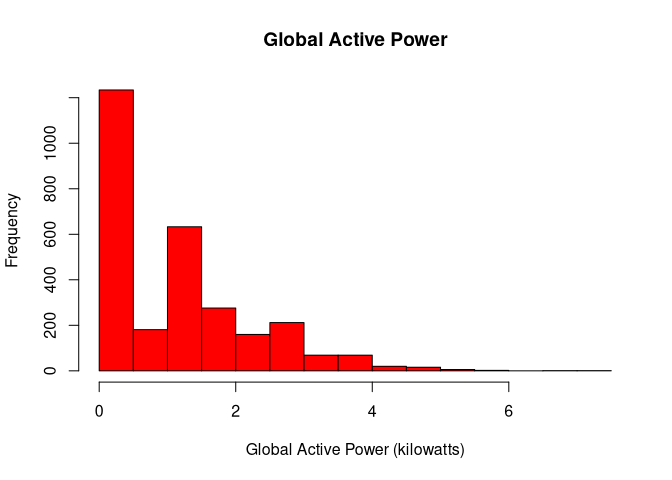
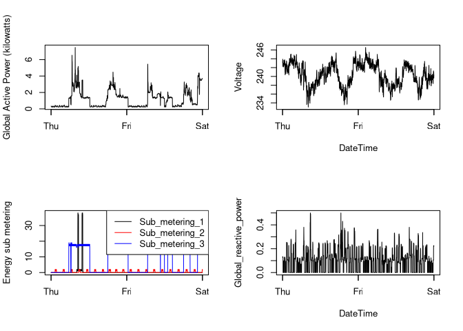

Base Plot
================

Base Plot 1
-----------

``` r
household_power_consumption <- read_delim("course-project-1//exdata_data_household_power_consumption/household_power_consumption.txt", 
                                          ";", escape_double = FALSE, col_types = cols(Date = col_datetime(format = "%d/%m/%Y "), 
                                                                                       Time = col_time(format = "%H:%M:%S")), 
                                          trim_ws = TRUE)
```

    ## Warning: 155874 parsing failures.
    ##  row                   col expected actual                                                                                        file
    ## 6840 Global_active_power   a double      ? 'course-project-1//exdata_data_household_power_consumption/household_power_consumption.txt'
    ## 6840 Global_reactive_power a double      ? 'course-project-1//exdata_data_household_power_consumption/household_power_consumption.txt'
    ## 6840 Voltage               a double      ? 'course-project-1//exdata_data_household_power_consumption/household_power_consumption.txt'
    ## 6840 Global_intensity      a double      ? 'course-project-1//exdata_data_household_power_consumption/household_power_consumption.txt'
    ## 6840 Sub_metering_1        a double      ? 'course-project-1//exdata_data_household_power_consumption/household_power_consumption.txt'
    ## .... ..................... ........ ...... ...........................................................................................
    ## See problems(...) for more details.

``` r
household_power_consumption<-subset(household_power_consumption,Date == "2007-02-01" | Date == "2007-02-02")

#png(file="plot1.png")

hist(household_power_consumption$Global_active_power,
     main = "Global Active Power",
     xlab = "Global Active Power (kilowatts)", 
     ylab = "Frequency",
     col = "red")
```

<!-- -->

``` r
#dev.off() 
```

Base Plot 2
-----------

``` r
household_power_consumption$DateTime<-as.POSIXct(paste0(household_power_consumption$Date," ",household_power_consumption$Time))

#png(file="plot2.png")

with(household_power_consumption,plot(x = DateTime,
                                      y = Global_active_power,
                                      type = "l",
                                      ylab = "Global Active Power (kilowatts)",
                                      xlab = ""))
```

<!-- -->

``` r
#dev.off() 
```

``` r
#png(file="plot4.png")
par(mfcol=c(2,2))

with(household_power_consumption,plot(x = DateTime,
                                      y = Global_active_power,
                                      type = "l",
                                      ylab = "Global Active Power (kilowatts)",
                                      xlab = ""))


with(household_power_consumption,plot(x = DateTime,
                                      y = Sub_metering_1,
                                      type = "n",
                                      ylab = "Energy sub metering",
                                      xlab = ""))
with(household_power_consumption,points(x = DateTime,
                                        y = Sub_metering_1,
                                        type = "l"))
with(household_power_consumption,points(x = DateTime,
                                        y = Sub_metering_2,
                                        type = "l",
                                        col="red"))
with(household_power_consumption,points(x = DateTime,
                                        y = Sub_metering_3,
                                        type = "l",
                                        col="blue"))
legend("topright",lty=1,col = c("black","red","blue"),legend = c("Sub_metering_1","Sub_metering_2","Sub_metering_3"))


with(household_power_consumption,plot(x = DateTime,
                                      y = Voltage,
                                      type = "l"))

with(household_power_consumption,plot(x = DateTime,
                                      y = Global_reactive_power,
                                      type = "l"))
```

<!-- -->

``` r
#dev.off() 
```
